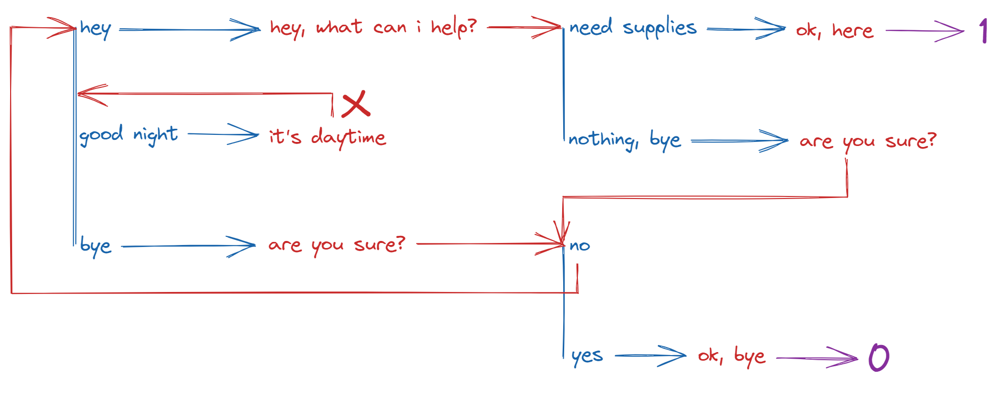

# RPG Entity Assistance

Most of basic implementations in RPG-like games are pretty much the same, thing like health control, xp and level, etc. This basic framework works as a pattern for highly generic customizable code for fast building any RPG-like architecture.
The usability is based on [base-class inheritance](#entity-base) and [plugins](#plugins) that work as modules, you can check for some implementation examples in *test.js* file, be confident that you can use your already made code if has any, and just add the plugins you need as long your entities inherit from [EntityBase](#entity-base) class, same way implementations like **item classes** have a base class that can be inherited to easily convert to a framework readable object.

---

## How To Start

First of all, i highly reccomend you to inherit from [EntityBase](#entity-base) and create your own classes, they do not implements anything more but the plugins and the internal features to make things work, if you need to set any custom properties like *name*, *id*, *hero class*, etc, you must create that by you own since that properties are easy and fast to set and not generic for many games.
Warnings given, i must explain the two *base classes* the framework provides in *lib/main.js*.

### Entity Base

That class covers the plugin exportation and [localStorage data saving](#on-promise-save), keeping simple, below here a snippet for a *Player* class that inherit from **EntityBase** and implements *level* and *health* plugins, both already declared on *main.js*.

```js
class Player extends EntityBase {
    constructor(name) {
        super([LevelPlugin, HealthPlugin]);
        this.name = name;
    }
}

// Player has access from all listed plugins
let hero = new Player("Hero");

console.log(hero.name);                  // Property from Player class
>> "Hero"
console.log(hero.level);                 // Property from LevelPlugin
>> 0
console.log(hero.levelByXpFormula(100)); // Method from LevelPlugin
>> 5
console.log(hero.health);                // Property from HealthPlugin
>> 100
console.log(hero.restoreHealth());       // Method from HealthPlugin
>> 100
```

#### On promise Save

The **EntityBase** has an implementation to save properties in *localStorage* just as changes are made, to use this setting you have to pass an **uid** as second argument on *super constructor*, also you have to use **[EntityPluginBase](#entity-plugin-base)** to implement the properties you want to save if you have custom ones.

```js
class Player extends EntityBase {
    constructor(uid, name) {
        super([LevelPlugin, HealthPlugin], uid);
        this.name = name;
    }
}
```

```js
let hero = new Player("hero.principal", "Hero");
console.log(hero.level);
>> 0
hero.level = 1;

// Refreshes the page
let hero = new Player("hero.principal", "Hero");
console.log(hero.level);
>> 1
```

> Keep in mind if you clear the cache ow run an *localStorage.clear()* all the data will be discarted.

### Entity Plugin Base

If you want to implement a new custom plugin you need to inherit from **EntityPluginBase**, that just holds an getter *injection_descriptors* used to inject methods and properties into **EntityBase**.
Here has an rule where if you want to implement your property with support to [localStorage data saving](#on-promise-save), you have to make a *getter/setter* to the property, this is necessary to the framework keep tracking the updates and save *on promise*.

```js
class Player extends EntityBase {
    constructor(uid, name) {
        super([CustomPlugin], uid);
        this.name = name;
    }
}

class CustomPlugin extends EntityPluginBase {
    __money__ = 0;
    get money() { return this.__money__; }
    set money(mn) { this.__money__ = mn; }
}
```

```js
let hero = new Player("hero.principal", "Hero");
console.log(hero.money);
>> 0
hero.money = 100;

// Refreshes the page
let hero = new Player("hero.principal", "Hero");
console.log(hero.money);
>> 100
```

---

## Plugins 

### Boss Plugin

#### Boss Stage Base


### Dialog Plugin

| |
|-|
|  |
| |

```js
const NPC1dialogs = {
    "dialog.first": [
        {question: "hey", reply: "hey, what can i help?", next: [
            {question: "need supplies", reply: "ok, here", response: 1},
            {question: "nothing, bye", reply: "are you sure?", next: ["dialog.first", 2]}
        ]},
        {question: "good night", reply: "it's daytime", next: "dialog.first", hide: true},
        {question: "bye", reply: "are you sure?", next: [
            {question: "no", next: "dialog.first"},
            {question: "yes", reply: "ok, bye", response: 0}
        ]}
    ]
};
```

#### Dialog Base


### Health Plugin


### Inventory Plugin

#### Inventory Base

#### Inventory Item Base

#### Inventory Item Category Base

#### Inventory Item Modifier Base


### Level Plugin


### LootTable Plugin

#### LootTable Base


### Quest Plugin

#### Quest Base

#### Quest Line Base


### Skill Plugin

#### Skill Base


### TradePlugin

#### Trade Base
